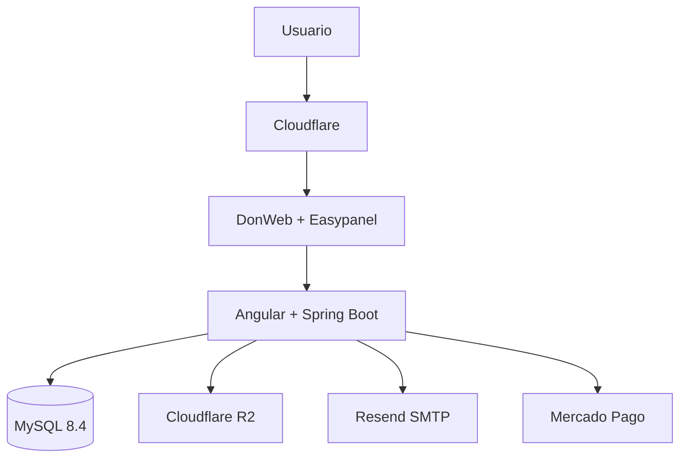

# Comercio Flex

Plataforma SaaS ecommerce multi-tenant para pequeños y medianos comercios. Cada
comercio dispone de una tienda pública y un panel administrativo, mientras la
plataforma conserva una administración global y aislamiento de datos por tenant.

## Estado del proyecto

Comercio Flex está desplegado y operativo en un entorno productivo bajo
[comercioflex.com.ar](https://comercioflex.com.ar). El producto se encuentra en
etapa **piloto / precomercial**: la arquitectura y los recorridos principales
están implementados, pero todavía no se atribuyen métricas comerciales, SLA ni
garantías de alta disponibilidad que no hayan sido verificadas.

## Capacidades actuales

- Tienda pública con categorías, catálogo, búsqueda, detalle de producto y
  branding por comercio.
- Productos en borrador o publicados, imagen principal y variantes genéricas con
  precio y stock propios.
- Inventario por variante mediante balances y movimientos auditables, recepción
  de mercadería y umbral configurable de stock bajo.
- Carrito persistente separado por `storeSlug`, checkout invitado, reservas de
  inventario y seguimiento de pedidos recientes desde el navegador.
- Pagos mediante Mercado Pago Checkout Pro y transferencia bancaria con
  comprobante privado, revisión administrativa, aprobación, rechazo y reintento.
- Emails transaccionales con branding del tenant, outbox persistente, worker,
  reintentos y backoff.
- Panel administrativo para dashboard, catálogo, inventario, pedidos, pagos,
  transferencias y configuración del comercio.
- Administración global de tenants, usuarios, provisioning y apariencia.

## Stack

| Área | Tecnologías |
|---|---|
| Frontend | Angular, TypeScript, SCSS |
| Backend | Java 21, Spring Boot, Maven |
| Datos | MySQL 8.4, Flyway |
| Storage | Cloudflare R2, API compatible con S3 |
| Email | Resend mediante SMTP |
| Pagos | Mercado Pago y transferencia bancaria |
| Infraestructura | DonWeb Cloud Server, Easypanel, Cloudflare |
| Calidad | Vitest, pruebas Spring, Testcontainers con MySQL 8.4 |
| CI | GitHub Actions |

Las versiones exactas de dependencias se consultan en `frontend/package.json` y
`backend/pom.xml`; no se duplican aquí para evitar documentación obsoleta.

## Arquitectura

El sistema es un **monolito modular**. Angular se compila dentro del artefacto de
Spring Boot y ambos se publican bajo el mismo origen HTTPS. El backend está
organizado en módulos de dominio (`tenant`, `identity`, `catalog`, `inventory`,
`order`, `payment`, `media`, `notification`, `dashboard` y administración de
plataforma), con separación entre API, aplicación, dominio e infraestructura.



Esta elección mantiene responsabilidades separadas sin introducir coordinación
distribuida innecesaria. No se describe el sistema como microservicios.

## Multi-tenancy

El aislamiento **database-per-tenant ya está implementado**:

```text
base de control
├── identidad global, tenants, membresías y routing
└── metadatos operativos de la plataforma

base tenant A    base tenant B    ...
└── catálogo     └── catálogo
    inventario       inventario
    pedidos          pedidos
    pagos            pagos
```

Este modelo reduce el riesgo de contaminación accidental y permite
backup/restore independiente. A cambio requiere más pools, migraciones,
provisioning y disciplina operacional; no se presenta como una solución de
escala ilimitada.

## Producción

- Dominio público: [https://comercioflex.com.ar](https://comercioflex.com.ar)
- DNS y edge HTTPS: Cloudflare.
- Servidor: DonWeb Cloud Server.
- Despliegue y operación del contenedor: Easypanel.
- Persistencia: MySQL 8.4 con base de control y una base por comercio.
- Objetos: buckets privados de Cloudflare R2 separados para medios de producto,
  comprobantes y backups.
- Notificaciones: Resend a través del adaptador SMTP.
- Pagos: integración con Mercado Pago y flujo independiente de transferencia.

Los secretos y credenciales viven fuera de Git. La guía conceptual de operación
está en [`docs/GUIA_DE_DESPLIEGUE.md`](docs/GUIA_DE_DESPLIEGUE.md).

## Estructura del repositorio

- `frontend/`: SPA Angular para storefront, administración y autenticación.
- `backend/`: aplicación Spring Boot modular y migraciones Flyway.
- `infra/`: MySQL local, contratos de variables y scripts de backup/restore.
- `.github/workflows/`: validación continua de frontend, backend y contenedor.
- `docs/`: arquitectura, API, alcance, roadmap, decisiones y guías.

## Desarrollo y pruebas

La preparación completa del entorno local está en
[`docs/GUIA_DE_DESARROLLO.md`](docs/GUIA_DE_DESARROLLO.md). Como referencia:

```powershell
# Frontend
cd frontend
npm ci
npm test -- --watch=false
npm run build

# Backend
cd ../backend
./mvnw test
```

MySQL local se levanta con Docker Compose según [`infra/README.md`](infra/README.md).

## Documentación

- [Arquitectura actual](docs/ARQUITECTURA.md)
- [Alcance original y estado actual](docs/ALCANCE_MVP.md)
- [Roadmap](docs/ROADMAP.md)
- [API](docs/API.md)
- [Modelo de datos](docs/MODELO_DE_DATOS.md)
- [Frontend](frontend/README.md)
- [Backend](backend/README.md)

El proyecto conserva algunos documentos históricos del MVP y ADR para explicar
por qué se tomaron determinadas decisiones. Cuando exista una diferencia, este
README, la arquitectura actual y el roadmap son las fuentes de estado vigentes.

## Versionado

El código continúa en etapa piloto. Para releases comerciales se adoptará
versionado semántico; esta nota no crea tags ni releases automáticamente.
