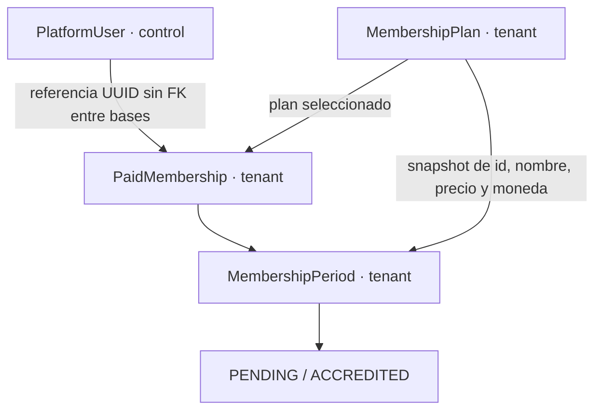

# RADIO — Fase 3: planes, socios y cuotas

## Base y alcance

Rama codex/radio-memberships, creada desde 6a19aed (Fase 2). Tras actualizar origin, main seguía en cbd012b sin fases 1/2: el usuario autorizó expresamente esta base dependiente. Árbol limpio al comenzar. Commit y PR de Fase 3 autorizados posteriormente al cierre de validación; merge y deploy siguen pendientes de autorización. Antes de integrar, incorporar las fases anteriores y revisar la base contra main.

Se implementan planes descriptivos, membresías comerciales y cuotas mensuales pendientes; administración y experiencia pública/privada. No hay cobro, transacciones, Mercado Pago, checkout, webhooks, renovación automática, transferencias, facturas ni emails comerciales nuevos. ACCREDITED existe como estado de dominio; sólo los fixtures lo acreditan.

## Modelo

La última migración tenant encontrada era V023. Se agregan V024__create_radio_membership_plans_and_members.sql y V025__create_radio_membership_periods.sql. No se cambian migraciones anteriores. El migrador habitual las aplica a cada esquema tenant, incluido ECOMMERCE, siguiendo el esquema homogéneo existente; sólo las APIs RADIO habilitan este dominio.

- membership_plans: id BIGINT interno, public_id UUID BINARY(16), nombre, descripción, precio DECIMAL(12,2), moneda, beneficios JSON ordenado, active, display_order y timestamps. Beneficios son textos; sin motor de canjes. Desactivación lógica, sin endpoint DELETE.
- paid_memberships: id y public_id, platform_user_id BINARY(16), current_plan_id, started_at, cancelled_at, created_at, updated_at. Una fila por usuario y base tenant. platform_user_id almacena el UUID público estable de platform_users (no su BIGINT interno). No se duplica nombre, email, teléfono, credenciales ni rol.
- membership_periods: id y public_id, membership_id, año/mes, fechas DATE de cobertura, plan_id y nombre snapshot, amount_snapshot y currency_snapshot, accreditation_status, accredited_at y timestamps.

El id interno de los planes se excluye de serialización; PaidMembership no se expone directamente. Las respuestas públicas y /me devuelven exclusivamente UUIDs públicos y los campos necesarios para la pantalla.

### Constraints e índices

Planes: public_id único; nombre no vacío, precio no negativo, moneda de tres letras mayúsculas con colación binaria; benefits debe ser array JSON. La API valida ISO 4217 mediante Currency y exige moneda igual a store_settings.currency_code, nombre de hasta 120, descripción 2000, 30 beneficios de hasta 240 caracteres, importe de hasta diez enteros y dos decimales. Índice active/display_order.

Membresías: public_id y platform_user_id únicos; FK interna current_plan_id a plan, sin borrado en cascada. Índice de plan provisto por FK y cancelled_at para filtros. No tenant_id, ni FK a control, ni cambio de significado en memberships administrativas.

Cuotas: public_id único, UNIQUE(membership_id,period_year,period_month), FKs internas a membresía/plan; mes 1–12, año 2000–9998, importe no negativo, moneda mayúscula, primer día y cobertura de exactamente un mes calendario, fin mayor al inicio. PENDING exige accredited_at NULL; ACCREDITED exige timestamp. Índice año/mes/estado más índices de las FKs.

## Reglas

### Mes y snapshots

Se reutilizan timezone y currency_code de store_settings. No se depende de la zona del servidor; MembershipService usa Clock inyectable membershipClock y YearMonth en la zona del tenant. El valor predeterminado ya existente del tenant es America/Argentina/Buenos_Aires y ARS.

El período de septiembre cubre [2026-09-01,2026-10-01). La UI resta un día al extremo exclusivo y muestra 30/09/2026. No son 30 días desde un pago. Los tests incluyen enero, febrero normal y bisiesto, marzo, diciembre, cambio de año y medianoche argentina frente a UTC.

El snapshot congela plan_id, plan_name_snapshot, importe y moneda. Editar nombre, precio o moneda del plan no recalcula cuotas existentes, pendientes ni acreditadas. La próxima cuota toma los valores vigentes. Descripciones y beneficios no se congelan: son informativos del plan seleccionado.

### Alta e idempotencia

Identidad y alta comercial permanecen separadas. Sin elegir un plan, /me devuelve state NONE sin crear filas. POST /me/membership acepta únicamente planPublicId. Verifica identidad global activa y plan activo dentro del tenant, crea/recupera la membresía y la cuota actual en una transacción tenant. Repetir el mismo plan recupera la misma relación/cuota; otro plan exige el endpoint explícito de cambio.

La DB garantiza unicidad y los INSERT con resolución de duplicado son no destructivos. Las operaciones sobre una membresía toman su bloqueo de fila; el lookup de cuota usa lectura actual con bloqueo para evitar snapshots antiguos después de esperar a una solicitud concurrente. Los tests simultáneos verifican tanto filas únicas como respuestas coherentes.

GET nunca crea cuotas. Si cambia el mes sin cuota, el estado es EXPIRED hasta que el socio solicita Generar cuota del mes. POST /current-period crea u obtiene sólo el mes actual; no acepta fechas ni importes, ni genera meses pasados/futuros. No hay scheduler ni renovación automática.

### Estado derivado

Precedencia: sin membresía NONE; cancelled_at presente CANCELLED; cuota del mes ACCREDITED → ACTIVE; cuota del mes PENDING → PENDING; sin cuota actual EXPIRED. Ninguna columna almacena ACTIVE o EXPIRED en la membresía. El mismo cálculo se usa para respuestas y filtros SQL administrativos.

### Cambio de plan y cancelación

PUT /me/membership/plan requiere nuevo plan activo. Si cambia efectivamente el plan, actualiza current_plan_id y reemplaza únicamente el snapshot de la cuota actual PENDING sin accredited_at. Si está ACCREDITED, esa cuota no cambia: current_plan_id define la selección para la próxima cuota. La pantalla distingue la cuota actual de la selección futura. Elegir el mismo plan no actualiza precio pendiente por accidente. No hay prorrateo, saldo ni devolución.

Cancelar fija cancelled_at, conserva membresía e historial y prevalece sobre cobertura acreditada. Es idempotente y terminal en V1: bloquea alta, cambio de plan y nuevas cuotas. No se implementa reactivación. Desactivar un plan conserva historial y cobertura, pero bloquea selección y nuevas cuotas de ese plan; el socio puede elegir otro activo antes de generar una nueva cuota.

## Autorización y aislamiento

Todos los recursos se resuelven por storeSlug → TenantResolver → databaseKey del servidor → TenantContext → tenantJdbcTemplate/tenantTransactionTemplate. Las nuevas rutas se registran explícitamente en TenantResolutionFilter; /admin conserva su resolución/validación administrativa. El controller exige RADIO activo. No hay acceso a tablas de pedidos, carrito, inventario ni pagos ecommerce.

/me identifica al usuario mediante PlatformPrincipal.publicId, comprueba ACTIVE en control a través de MemberIdentityDirectory y no acepta identidad, precio, estado, moneda ni cobertura del request de selección. Campos JSON desconocidos se rechazan. No hay GET de membresía/cuota arbitraria para usuarios finales. Admin usa UUIDs resueltos únicamente en la base del tenant autorizado; un UUID de A en B no habilita acceso.

MemberIdentityDirectory es un puerto con adaptador control separado. El listado tenant recupera primero referencias comerciales y termina su transacción; luego resuelve identidades globales en un batch. No hay JOIN entre bases ni datos personales duplicados. Una identidad eliminada conserva historia comercial y se muestra como no disponible.

Se agregan permisos explícitos VIEW_RADIO_MEMBERSHIPS y MANAGE_RADIO_PLANS a OWNER/ADMIN. STAFF no los recibe. MANAGE_MEMBERSHIPS existente conserva su semántica administrativa y no se reutiliza. Registro no agrega roles ni filas en memberships. Super Admin conserva su autorización existente; su rol global por sí solo no habilita el admin tenant.

La revisión explícita de MembershipRole, TenantPermission, SecurityConfig, MembershipController y TenantResolutionFilter confirma que sólo TenantMembership administrativo alimenta TenantPermissionAuthorizationManager. MembershipRoleTests comprueba OWNER/ADMIN/STAFF y la conservación de MANAGE_MEMBERSHIPS; enrollmentUsesSessionAndDatabasePriceAndRejectsMassAssignment exige rol global USER, cero filas administrativas tras asociarse y 403 al crear planes; tenantAndOwnerIsolationApplyToEveryLookupAndAdminHistory exige 403 en listados e historial admin para el socio.

CSRF sigue obligatorio en todos los writes nuevos. GET público sólo habilita planes activos; /me requiere sesión y los endpoints admin permisos reales. El frontend refuerza con guards; la protección no depende de ellos.

## Contratos API

Base /api/v1/stores/{storeSlug}. Respuestas sin IDs internos. Listados de socios/historial paginan con offset no negativo (máximo 1.000.000) y lotes de 100.

| Acceso | Método y ruta | Efecto |
|---|---|---|
| Público | GET /membership-plans | Activos, ordenados por displayOrder e id estable |
| Propio | GET /me/membership | Estado, plan seleccionado, cuota actual y fechas |
| Propio + CSRF | POST /me/membership | Alta con planPublicId y cuota actual |
| Propio | GET /me/membership/current-period | Cuota actual o respuesta vacía si no existe |
| Propio + CSRF | POST /me/membership/current-period | Crear/obtener cuota actual |
| Propio | GET /me/membership/periods | Historial propio |
| Propio + CSRF | PUT /me/membership/plan | Cambio explícito con planPublicId |
| Propio + CSRF | POST /me/membership/cancel | Cancelación lógica |
| Admin | GET /admin/membership-plans | Todos los planes |
| Admin + CSRF | POST /admin/membership-plans | Crear plan |
| Admin + CSRF | PUT /admin/membership-plans/{publicId} | Editar/activar/desactivar |
| Admin | GET /admin/paid-memberships | Identidad y estado/cuota, filtros state y planPublicId |
| Admin | GET /admin/paid-memberships/{publicId}/periods | Historial autorizado |

PlanInput: name, description, price, currency, benefits[], active, displayOrder. Errores de datos 400; recurso ajeno/inexistente o tipo no RADIO 404; plan inactivo, cancelación o cambio por endpoint incorrecto 409; falta de sesión 401; falta de permisos/CSRF 403. No existe endpoint de acreditación ni cobro.

## Frontend

Socios (/socios) obtiene cards de la API, permite elegir y confirmar. Un visitante va a login con next=socios, única continuación admitida, y vuelve a la selección conservando tenant. El backend determina el precio al confirmar; como todavía no hay cobro, el importe final pendiente se muestra en Mi cuenta.

Mi cuenta muestra saludo, estado y snapshot del período. Mi plan agrega selección futura y beneficios descriptivos. Cuotas muestra historial, sin IDs de proveedor ni CTA de pago real. Mi perfil de Fase 2 sigue disponible. Cancelación pide confirmación visible. La navegación funciona por slug y dominio propio.

Admin existente resuelve tenantSettings al entrar y compone centralmente la navegación por TenantType: RADIO tiene Socios, Planes y Cuotas; ECOMMERCE conserva operación, catálogo y pagos. Formularios y tablas incluyen estados vacíos, errores y controles de paginación. Cuotas permite seleccionar un socio y consultar su historial. Tablas con scroll horizontal contenido, cards adaptables y menú móvil existente.

## Validación

Validación de cierre del 10/09/2026:

- Frontend completo: 324 tests aprobados en 62 archivos.
- Chrome real: 19 tests de membresías aprobados a 390×844 y 1920×1080 en el cierre; también pasaron previamente 768×1024 y 1366×900. Incluyen geometría de cards, cuenta, navegación y tablas, además de flujos de componentes.
- Frontend production build: correcto, dentro de los presupuestos configurados.
- Docker build: correcto con el Dockerfile habitual; imagen local comercio-flex:radio-memberships, manifest sha256:48aa14ca0dbd7d1c53e5f0e121ca0a41e61b8b7014a71d5c8d81caa5e54d8013. Sin push ni ejecución de despliegue.
- Backend completo: mvn -Dradio.browser=true package terminó con BUILD SUCCESS (18:04 minutos). 438 tests, 0 fallos, 0 errores, 0 omitidos; 75 reportes XML Surefire. Incluye 21 casos de RadioMembershipIntegrationTests y 4 de MembershipRoleTests (uno agregado en este cierre).
- Backend build: JAR ejecutable generado y reempaquetado por Spring Boot.
- MySQL 8.4.10: V024/V025 aplicadas; control y dos radios en bases separadas; aislamiento, UUID ajeno/IDOR, CSRF, usuario deshabilitado, privilegios administrativos, calendario, snapshots de precio/nombre/moneda y filtros de estado aprobados. Altas simultáneas producen una membresía y una cuota; generación simultánea del mes siguiente produce una sola cuota adicional, con respuestas coherentes.
- ECOMMERCE: regresión completa aprobada de catálogo, productos, inventario, pedidos, pagos, identidad y permisos; test explícito de navegación por tipo y rechazo de planes RADIO en tenant ECOMMERCE.
- E2E HTTP real: aprobado contra Spring Boot, build frontend y MySQL aislado. Admin crea plan, usuario se registra e ingresa, elige/confirma, consulta cuota, cierra/reabre sesión y conserva selección; admin consulta socio e historial. Geometría de cuenta comprobada en anchos 390, 768, 1366 y 1920.
- Aviso de infraestructura de tests: contextos previos mantienen tareas/conexiones tras detener sus contenedores y Surefire finaliza su JVM después de 30 segundos de cierre. Es el aviso existente de Fase 2; Maven termina con código 0 y los 438 tests pasan. No se amplió este trabajo para reformar ese harness. La captura de salida del proceso de navegador se corrigió y no aparece el aviso de canal corrupto.
- El primer intento de suite/build Docker falló porque Docker Desktop estaba apagado; se inició y se repitieron las ejecuciones. No fue un fallo funcional de la aplicación.
- git diff --check y revisión adicional de whitespace/conflictos de archivos nuevos: correctos. No hay archivos temporales entre los cambios; los logs están en backend/target, excluido de Git.

Pruebas reproducibles:

- Backend general: mvn test (el E2E de navegador es opt-in).
- Frontend: npm test -- --watch=false; npm run build -- --configuration production.
- E2E real: después del build frontend, desde backend: mvn -Dtest=RadioMembershipIntegrationTests#browserEndToEnd -Dradio.browser=true test. Requiere Node, Playwright instalado por las dependencias frontend y Chrome/Chromium. CHROME_BIN permite elegir el ejecutable; Windows usa Chrome estándar si no se configura.
- E2E ejecuta HTTP real con Spring Boot en puerto aleatorio, proxy local y bases Testcontainers. Crea plan desde admin, registra usuario, vuelve desde login a Socios, confirma, verifica cuota PENDING, reingresa y comprueba listado/historial admin. No accede a producción.
- Responsive: ng test --watch=false --browsers=ChromiumHeadless --include=src/app/features/radio/membership.spec.ts --browser-viewport=390x844, repetir 768x1024,1366x900,1920x1080. CHROME_BIN según instalación. Jsdom no mide geometría; las verificaciones geométricas corren en los pases reales.

## Pasos manuales y deuda

1. Integrar primero Fase 1/2; revisar base y versiones Flyway si main avanzó. No se migró ninguna base persistente de aplicación en esta entrega.
2. Aplicar V024/V025 con el migrador habitual en la versión aprobada. Configurar moneda/zona del tenant; crear planes desde un OWNER o ADMIN de RADIO. No se crean planes/usuarios de demo en migraciones.
3. No hay pagos reales: una cuota PENDING no otorga cobertura ACTIVE. Las pruebas acreditan directamente la DB; nunca ofrecer esa operación a usuarios finales.
4. La Fase 4 debe prohibir modificar snapshots desde el momento en que exista un intento de cobro, además de conservar toda cuota acreditada. Hoy no hay intentos/transacciones.
5. Reactivación, prorrateo, cambios con devolución, renovación automática y acreditación manual quedan fuera de alcance. La cancelación terminal puede necesitar un flujo explícito futuro.
6. El plan y sus beneficios actuales pueden cambiar; sólo referencia/nombre/importe/moneda de la cuota se congelan. La identidad global se consulta al listar; si desaparece, se conserva historia con identidad no disponible.
7. Los planes se listan completos; socios e historial usan lotes de 100. Los listados admin pueden hacer varias consultas tenant por lote para componer plan/período; optimización futura si el volumen lo exige.
8. Mantener la configuración y límites SMTP/rate limiting de Fase 2. Se conservan los avisos de herramientas y del cierre de contextos de tests documentados en Fase 2.

## Fase 4 propuesta

Crear MembershipCheckoutService independiente de Order y PaymentApplicationService: toma un MembershipPeriod propio y PENDING ya persistido, valida tenant/sesión y congela su snapshot para cualquier intento de cobro. Crear intentos/transacciones tenant con idempotencia y una referencia de enrutamiento control para notificaciones. Reutilizar CheckoutProGateway a través de un adaptador que no requiera pedidos.

MembershipPaymentWebhookHandler debe verificar firma, consultar el pago canónico y comprobar vendedor, moneda, importe, referencia, tenant y cuota. Acreditar exactamente una vez mediante transacción y estado verificado, preservar snapshot e historial y derivar ACTIVE únicamente por cobertura del mes. La vuelta del navegador no acredita. Agregar concurrencia, duplicados, múltiples radios/usuarios, rechazos y reconciliación antes del piloto. Nada de esto se implementa en Fase 3.

## Inventario

Comparación contra 6a19aed: 25 archivos creados y 13 modificados. No se eliminaron archivos. Los reportes generados en target/dist no forman parte de la entrega.

### Creados

- `backend/src/main/java/com/comercioflex/membership/api/MembershipController.java`
- `backend/src/main/java/com/comercioflex/membership/application/MemberIdentityDirectory.java`
- `backend/src/main/java/com/comercioflex/membership/application/MembershipProblem.java`
- `backend/src/main/java/com/comercioflex/membership/application/MembershipRepository.java`
- `backend/src/main/java/com/comercioflex/membership/application/MembershipService.java`
- `backend/src/main/java/com/comercioflex/membership/domain/MembershipPeriod.java`
- `backend/src/main/java/com/comercioflex/membership/domain/MembershipPlan.java`
- `backend/src/main/java/com/comercioflex/membership/domain/MembershipState.java`
- `backend/src/main/java/com/comercioflex/membership/domain/PaidMembership.java`
- `backend/src/main/java/com/comercioflex/membership/infrastructure/JdbcMembershipRepository.java`
- `backend/src/main/java/com/comercioflex/membership/infrastructure/MembershipConfiguration.java`
- `backend/src/main/java/com/comercioflex/membership/infrastructure/control/ControlMemberIdentityDirectory.java`
- `backend/src/main/resources/db/migration/tenant/V024__create_radio_membership_plans_and_members.sql`
- `backend/src/main/resources/db/migration/tenant/V025__create_radio_membership_periods.sql`
- `backend/src/test/java/com/comercioflex/RadioMembershipIntegrationTests.java`
- `docs/RADIO_FASE_3.md`
- `frontend/e2e/radio-membership.cjs`
- `frontend/src/app/core/tenant/admin-tenant.ts`
- `frontend/src/app/features/radio/membership-account-page.ts`
- `frontend/src/app/features/radio/membership-admin-home.ts`
- `frontend/src/app/features/radio/membership-admin-page.ts`
- `frontend/src/app/features/radio/membership-api.service.ts`
- `frontend/src/app/features/radio/membership-plans-page.ts`
- `frontend/src/app/features/radio/membership.scss`
- `frontend/src/app/features/radio/membership.spec.ts`

### Modificados

- `backend/src/main/java/com/comercioflex/config/SecurityConfig.java`
- `backend/src/main/java/com/comercioflex/config/SpaForwardController.java`
- `backend/src/main/java/com/comercioflex/identity/domain/MembershipRole.java`
- `backend/src/main/java/com/comercioflex/identity/domain/TenantPermission.java`
- `backend/src/main/java/com/comercioflex/tenant/api/TenantResolutionFilter.java`
- `backend/src/test/java/com/comercioflex/identity/domain/MembershipRoleTests.java`
- `frontend/src/app/app.routes.spec.ts`
- `frontend/src/app/app.routes.ts`
- `frontend/src/app/features/radio/radio-auth-page.ts`
- `frontend/src/app/features/radio/radio-layout.ts`
- `frontend/src/app/features/radio/radio.routes.ts`
- `frontend/src/app/layouts/admin-layout/admin-layout.html`
- `frontend/src/app/layouts/admin-layout/admin-layout.ts`

## Estado final de entrega

Fase 3 implementada y validada, pendiente sólo de revisión e integración autorizada. Este cierre preservó el código de producción existente y agregó la prueba explícita de permisos, reforzó la prueba de alta comercial, corrigió la captura del E2E y completó esta documentación. Al cierre de validación no se había hecho commit ni PR. Posteriormente se autorizó prepararlos sobre codex/radio-identity para aislar el diff de Fase 3. No se hizo merge, deploy ni migración de una base persistente de aplicación. No se implementó Fase 4.
